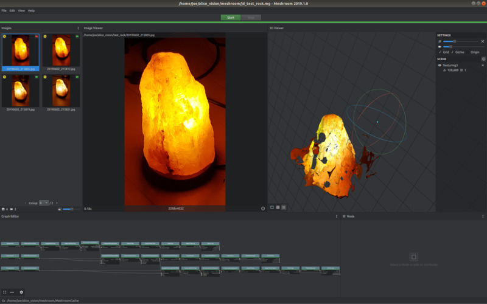

# AliceVision_Ubuntu
A how-to for building AliceVision on Ubuntu 18.04

Hardware pre-prerequisites: an Nvidia CUDA compatible video card / GPU is required. One of the numerical packages (Magma) has a non-optional dependency on this. If you don't have this graphics card you are currently out of luck: there is no CPU fall back that I'm aware of.

These instructions were based on many hours of trial-and-error on a working Ubuntu 18.04 distribution kitted with a modest AMD graphics card (NVIDIA GeForce GT 730).  I'd normally refine these instructions by testing on a clean installation running in a virtual machine, but because of the CUDA dependency this is not possible.




## Pre build preperation

Let's keep it all together in under one directory. Let's call this 'alice_vision'. Define a environment variable:

export ALICEVISION_DIR=$HOME/alice_vision
mkdir $ALICEVISION

suto apt install gfortran gcc-6
sudo apt install libboost-all-dev libilmbase-dev libopenexr-dev libopenimageio-dev libeigen3-dev libopenblas-dev libxinerama-dev libxcursor-dev 


## Install CUDA

sudo add-apt-repository ppa:graphics-drivers/ppa
sudo apt update
sudo ubuntu-drivers autoinstall

## Build and install Magma

cd $ALICEVISION_DIR
wget http://icl.utk.edu/projectsfiles/magma/downloads/magma-2.5.0.tar.gz
tar xvzf magma-2.5.0.tar.gz
cd magma-2.5.0
cp make.inc-examples/make.inc.openblas ./make.inc
export OPENBLASDIR=/usr
export CUDADIR=/usr
make -j4
sudo make install

This will install under /usr/local/magma

## Build and install uncertaintyTE

```
cd $ALICEVISION_DIR
git clone https://github.com/alicevision/uncertaintyTE.git
cd uncertaintyTE
export MAGMA_ROOT=/usr/local/magma
mkdir build; cd build; cmake ..
make -j4
sudo make install
```

## Build and install geogram

```
cd $ALICEVISON_DIR
git clone https://github.com/alicevision/geogram.git
sh -f configure.sh
cd build/Linux64-gcc-dynamic-Release 
make -j4
make install
```

## Build and install OpenImageIO

```
cd $ALICEVISION_DIR
git clone https://github.com/OpenImageIO/oiio.git
cd oiio
mkdir build; cd build; cmake ..
make -j4
sudo make install
```

## Build install alembic

```
cd $ALICEVISION_DIR
git clone https://github.com/alicevision/alembic.git
cd alembic
mkdir build; cd build; cmake ..
make -j4
sudo make install
```

## Build and install AliceVision

This requires older gcc version 6 to install.

```
cd $ALICEVISION_DIR
git clone https://github.com/alicevision/AliceVision.git
cd AliceVision
mkdir build; cd build; 
CC=gcc-6 CXX=g++-6 cmake ../AliceVision
make -j4

